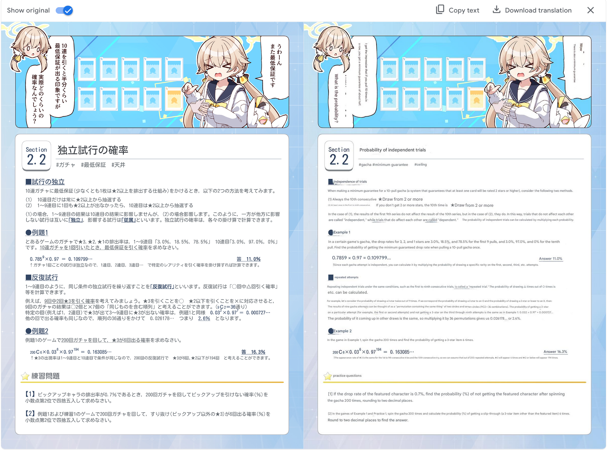

# Novel Translator

A three step process to translate japanese novels and textbooks into english using Google's image translate.

*Note: Only novels where the text is horizontal are supported well. Google's translator renders vertical text sideways. 

### Scripts

1. Renders images of the pdf into a folder. If you already have a folder of images you may skip this step. Note that some pages can error out, you may want to stop it here to inspect before continuing.

2. Translates the images using Google image translate. It starts a real instance of Google Chrome, navigates to the website, and pastes the images from clipboard. *I am not good at webscraping, so let me know if anyone figures out how to bypass the bot detection and not have to use a real browser.

3. Creates a new pdf from the translated images. If you want to keep it as a folder of images you may skip this step.

### Running
Make sure that you edit `start.ts` to translate your own pdf
```ts
npm install
npm start
```


